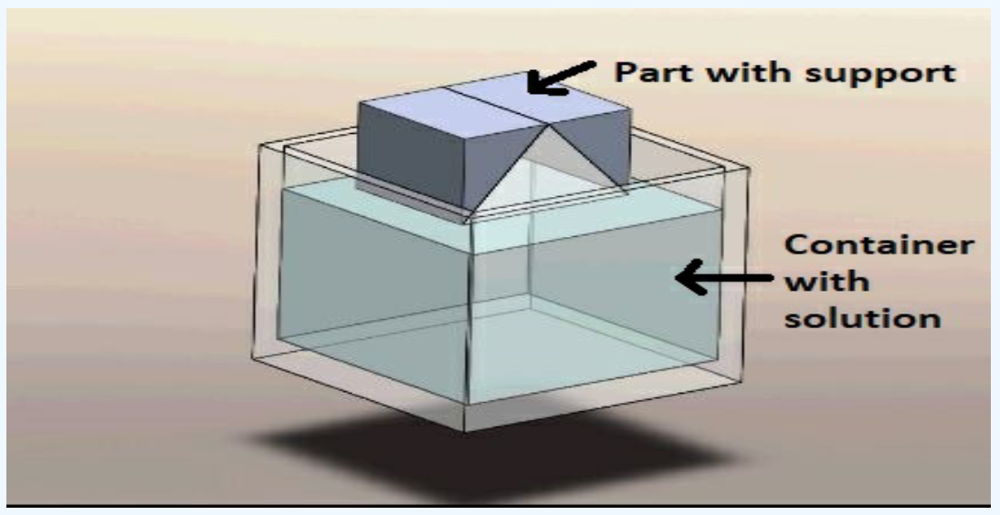

# Ex.No.9 - SIMULATION OF POST PROCESSING IN ADDITIVE MANUFACTURING

### DATE: 

## AIM: 
### To simulate the post processing of 3d printed parts via support Removal, UV Curing & Heat Treatment.

## REQUIREMENTS:
### System - Windows 7 or higher, 1 GB RAM.

## PROCEDURE:

## Procedure for support removal
### 1.	Select support removal from the list.
### 2.	All the parts related to support removal are shown on the screen.
### 3.	Select the parts in sequence in which they are shown.
### 4.	When the first part is selected then it will open in the blank space in the left side of the screen.
### 5.	If the user follows an incorrect sequence then a pop-up will appear on the screen showing the name of the part to be selected.

## Procedure for UV Curing
### 1.	Select UV curing from the list.
### 2.	All the parts related to UV curing are shown on the screen.
### 3.	Select the parts in sequence in which they are shown.
### 4.	When the first part will be selected then it will open in the blank space on the left side of the screen.
### 5.	If the user follows an incorrect sequence then a pop-up will appear on the screen showing the name of the part to be selected.

## Procedure for heat treatment
### 1.	Select heat treatment from the list.
### 2.	All the parts related to heat treatment are shown on the screen.
### 3.	Select the parts in sequence in which they are shown.
### 4.	When the first part is selected then it will open in the blank space in the left side of the screen.
### 5.	If the user follows an incorrect sequence then a pop-up will appear on the screen showing the name of the part to be selected.

## OUTPUT :

## Support Material Removal

### PRODUCT WITH SUPPORT MATERIAL

The product has to be printed with support material if the overhang angle is more than 45.Support material is often necessary in 3D printing to provide temporary structural support for overhangs, bridges, and other complex geometries that cannot be printed directly onto the build plate without additional support.In order to prevent, sagging or collapsing support material is needed.

### CONTAINER WITH CHEMICAL

In order to remove the support material, the printed product has to be dipped in chemicals like isopropyl alcohol,acetone,etc, for several minutes to few hours. The solvent should be compatible with the support material used in the printing process.

### PRODUCT IN THE CONTAINER

Immerse the 3D printed object, along with the attached support structures, into the chemical bath. Ensure that the entire printed part is fully submerged.

### FINAL PRODUCT

Once the support material has dissolved, remove the printed object from the chemical bath and rinse it with clean water to remove any remaining traces of the support material and the solvent. This step ensures that no residual chemicals are left on the object.

### START PROCESS

To remove support material using a chemical bath, fill a container with water or a suitable solvent recommended by the manufacturer. Submerge the 3D printed object, including the support structures, in the bath and ensure it is fully covered. Gently agitate or stir the solution to aid in the dissolution process. Periodically check the support material to monitor its dissolution progress. The time needed for complete dissolution depends on factors like object size, support complexity, and solvent concentration.

### STOP PROCESS

After dissolution of support material the product has to be taken out.Then it is rinsed with water to remove the remaining support material and chemical deposition.
 

## UV Curing of 3D printed part

### PART BEFORE UV CURING

UV curing is a post-processing technique commonly used in 3D printing.It is used to harden the resin and solidfy the product.Before UV curing, the surface of a 3D printed part may have a raw or unfinished appearance.surface of the printed part may exhibit visible layer lines or "staircase effect."

### UV CURING MACHINE

A UV curing machine, also known as a UV curing chamber or UV curing system.A UV curing machine consists of an enclosure or chamber with UV lights, reflective surfaces, and a system to control the curing process. The chamber is designed to provide a controlled environment for effective UV curing.

### PART IN UV MACHINE

The product is placed inside uv chamber.

### FINAL PRODUCT

UV curing is crucial to achieve the final strength and stability of 3D printed objects using photosensitive resins. It improves the mechanical properties of the printed parts and enhances their overall quality.

### START PROCESS

The printed object is placed in a UV curing chamber or exposed to a UV light source. The UV light activates the photoinitiators in the resin, initiating a chemical reaction called polymerization.

### STOP PROCESS

Once the UV curing process is complete, it is important to remove any uncured resin or residue from the object. This can be done by rinsing the object in isopropyl alcohol (IPA) or a suitable solvent and gently scrubbing to ensure a clean and smooth surface.

 

## Heat Treatment of 3D printed part

### PART BEFORE HEAT TREATMENT

3D printing creates objects by building them layer by layer. As a result, the surface of the printed part may exhibit visible layer lines. These lines are a result of the additive manufacturing process and can be more pronounced on curved or sloping surfaces

### HEAT TREATMENT OVEN

A heat treatment oven, also known as a tempering oven or annealing oven, is a specialized piece of equipment used for heat treating materials, including 3D printed parts. In the context of 3D printing, heat treatment ovens are often used to enhance the mechanical properties and overall performance of printed parts, optimizing their strength, durability, and other desired characteristics.

### PART IN OVEN

Before the part is placed in the oven, the oven is preheated to the desired temperature. Once the oven reaches the specified temperature, the part is carefully loaded into the oven. It is essential to place the part in a position that allows for proper heat distribution and ensures even treatment throughout the part.

### FINAL PART

The final product after heat treatment is a 3D printed part that exhibits improved mechanical performance, enhanced dimensional stability, refined surface finish, and tailored material properties. The specific changes and improvements depend on the material, heat treatment process, and the goals set for the part's performance

### START PROCESS

The heat treatment process for a 3D printed part involves preheating the oven, loading the part, heat soaking it at a specific temperature, and then gradually cooling it down through controlled cooling. This process ensures uniform heat distribution and promotes the desired material transformation.

### STOP PROCESS

After the heat treatment process and cooling, the 3D printed part is carefully unloaded from the oven. It is then inspected for any visible defects like warping, cracking, or distortion. Various testing procedures may be conducted to evaluate its mechanical properties, such as tensile strength, hardness, or dimensional accuracy. This inspection and testing stage ensures the quality and integrity of the heat-treated part.

 

### Name: Sneha Basyal M
### Register Number: 212222240101

## Result: 
### Thus the simulation on the Postprocessing in additive manufacturing is completed.
